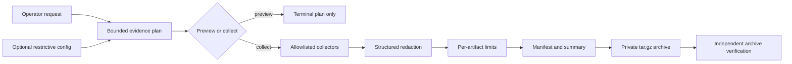

```text
 ___ _  _  ___ ___ ___  ___ _  _ _____   ___  _   ___ _  __
|_ _| \| |/ __|_ _|   \| __| \| |_   _| | _ \/_\ / __| |/ /
 | || .` | (__ | || |) | _|| .` | | |   |  _/ _ \ (__| ' <
|___|_|\_|\___|___|___/|___|_|\_| |_|   |_|/_/ \_\___|_|\_\
```

# incident-pack

`incident-pack` creates bounded diagnostic bundles for Linux service-desk escalation. It
collects a fixed allowlist of service, resource, journal, package, configuration-metadata and
explicit network evidence, then builds and verifies a private `tar.gz` archive.

The project is deliberately conservative. It does not collect environment variables, process
arguments, private keys, credential stores, arbitrary files or configuration-file contents. It
does not upload the archive or attempt remediation.

> [!WARNING]
> Redaction reduces disclosure risk; it cannot recognise every possible secret. Verify and inspect
> every bundle before sharing it.

## Status and platform scope

Version `0.1.0` is an alpha release for Linux systems using systemd and the APT/dpkg package
stack. The primary CI targets are Ubuntu 22.04 and Ubuntu 24.04 with Python 3.11 and 3.13.
Debian 12 is a secondary target but is not part of the hosted CI matrix.

Requirements:

- Python 3.11 or later;
- Bash 5 or later;
- systemd tools for service evidence;
- `journalctl` for journal evidence;
- `dpkg-query` for package evidence.

Missing host capabilities produce a verified partial bundle. They do not trigger package
installation, privilege escalation or a broader collection.

## Architecture and data flow



The Python command layer validates the plan, enforces redaction and verifies the
finished archive. Small Bash collectors obtain narrowly defined host evidence.
Collectors cannot expand the compiled source allowlist or invoke remediation.

## Install

Install the tagged release with `pipx`:

```bash
pipx install "git+https://github.com/ericjaytech/incident-pack.git@v0.1.0"
incident-pack --version
```

For development, clone the repository and install it into a virtual environment:

```bash
git clone https://github.com/ericjaytech/incident-pack.git
cd incident-pack
python3 -m venv .venv
source .venv/bin/activate
python -m pip install --upgrade pip
python -m pip install .
incident-pack --version
```

## Preview before collecting

Preview resolves the exact evidence plan, exclusions, limits and privilege state without reading
diagnostic content, connecting to a network target or creating files:

```bash
incident-pack --service nginx --since 2h --preview
```

`--preview` is the tool's dry-run contract. It is deliberately named after the
operator outcome: the command shows the complete plan and has no collection or
file-writing side effects.

Example output:

```text
INCIDENT PACK PREVIEW
=====================
Service: nginx.service
Journal range: 7200 seconds
Privilege: non-root
Root acknowledged: no
Collection allowed: yes

Evidence plan:
- [PLANNED] service.status: Allowlisted systemd service properties
- [PLANNED] resources.pressure: CPU, memory and disk pressure
- [PLANNED] logs.journal: Bounded recent service journal records
- [PLANNED] packages.metadata: Installed package metadata
- [PLANNED] configuration.metadata: Service-unit metadata and checksums
- [NOT REQUESTED] network.dns: Explicit DNS checks
- [NOT REQUESTED] network.connectivity: Explicit bounded TCP checks

No diagnostic content was read, no network connection was made, and no files were created.
```

## Create a bundle

The output directory must already exist and the output file must be new:

```bash
incident-pack --service nginx --since 2h --output case-1042.tar.gz
```

A successful command prints the archive path and SHA-256. Collector failures can still produce a
useful partial bundle; `summary.txt` and `manifest.json` identify unavailable or truncated
evidence.

`incident-pack` never invokes `sudo`. If it is already running with effective UID 0, collection
is blocked until the caller explicitly acknowledges that state:

```bash
sudo .venv/bin/incident-pack --service nginx --since 2h \
  --output case-1042.tar.gz --allow-root
```

Root execution does not widen the source allowlist or remove limits.

### Exclude an evidence category

```bash
incident-pack --service nginx --since 2h \
  --output case-1042.tar.gz --exclude 'logs.journal'
```

Exclusions use the logical identifiers shown by `--preview`. An unmatched exclusion is rejected so
that a typo cannot create false assurance.

### Request network checks

No active external network check runs by default. DNS and TCP checks require explicit targets:

```bash
incident-pack --service nginx --since 2h \
  --output case-1042.tar.gz \
  --dns-target api.example.test \
  --connect-target api.example.test:443
```

These checks are bounded, retain address family and scope rather than resolved addresses, and send
no application payload. They are diagnostics, not a port scanner or HTTP client.

## Configure limits and exclusions

Pass a UTF-8 TOML file with `--config`:

```toml
[limits]
journal_range_seconds = 3600
max_journal_records = 500
max_message_bytes = 4096
max_artifact_bytes = 2097152
max_total_bytes = 8388608
max_archive_bytes = 4194304
collector_timeout_seconds = 5

[exclusions]
patterns = ["logs.journal"]
```

```bash
incident-pack --service nginx --output case-1042.tar.gz \
  --config incident-pack.toml
```

Configuration can reduce collection or exclude allowed artifacts. It cannot add commands, paths,
sources or network targets, and compiled hard limits remain in force.

## Verify and inspect

Verify the structure, member types, declared limits and SHA-256 checksums before inspection:

```bash
incident-pack --verify case-1042.tar.gz
```

After verification, list the archive and read its summary and manifest without extracting it:

```bash
tar -tzf case-1042.tar.gz
tar -xOf case-1042.tar.gz summary.txt
tar -xOf case-1042.tar.gz manifest.json
```

The final archive is created with mode `0600`. Verification warns if group or other read bits have
subsequently been added. SHA-256 detects changed content; it does not encrypt the bundle or prove
who created it.

## Bundle contents

Depending on the plan and available host capabilities, a bundle can contain:

- `summary.txt`: concise service state, journal error count, resource pressure, connectivity and
  missing-evidence summary;
- `manifest.json`: tool version, collection state, limits, exclusions, artifact sizes and SHA-256
  checksums;
- `evidence/service.json`: allowlisted systemd properties;
- `evidence/resources.json`: load, memory, pressure-stall and root-filesystem capacity;
- `evidence/journal.ndjson`: bounded, redacted journal records;
- `evidence/packages.json`: installed package metadata;
- `evidence/configuration.json`: service-unit paths, file metadata and checksums, never contents;
- `evidence/dns.json` and `evidence/connectivity.json`: explicitly requested network results.

The manifest marks each applicable artifact as `collected`, `excluded`, `skipped` or `error`.
Any non-collected or truncated evidence makes the overall bundle `partial`.

## Synthetic fixtures

The Python tests use invented systemd, journal, resource, package, DNS and
connectivity responses. Versioned complete, partial and invalid manifests live in
`tests/fixtures/manifests/`. Bats tests replace host commands with isolated fake
executables. No employer systems, screenshots or operational data are included.

## Exit codes

| Code | Meaning |
| ---: | --- |
| `0` | Preview, collection or verification completed successfully. A collected bundle can still be partial. |
| `2` | Command-line input, configuration or the evidence plan is invalid. |
| `3` | Collection was blocked by the privilege policy. |
| `4` | Collection publication or archive verification failed. |

## Security boundary

Read [docs/security-model.md](docs/security-model.md) before using the tool with operational data.
The important residual risk is simple: a structurally verified bundle can still contain context
that is inappropriate for its intended recipient. Human review remains mandatory.

## Limitations

- Linux, systemd, journalctl and the APT/dpkg package stack define the current
  platform boundary.
- A partial bundle may be useful for escalation but is not evidence that the host
  is healthy or fully observed.
- Redaction cannot guarantee removal of every secret or personal identifier.
- Checksums detect changed bytes; they do not provide encryption, provenance or
  author identity.
- DNS and TCP checks require explicit targets and do not test application-layer
  behaviour.
- The tool never uploads, extracts, repairs, restarts or reconfigures anything.

## Development

```bash
python -m pip install -e '.[dev]'
python -m ruff format --check .
python -m ruff check .
python -m pytest
python -m build
```

Shell release gates use ShellCheck, shfmt and Bats:

```bash
shellcheck src/incident_pack/collectors/*.sh tests/bats/*.bats
shfmt -d -ln bash src/incident_pack/collectors/*.sh
shfmt -d -ln bats tests/bats/*.bats
bats tests/bats
```

See [CHANGELOG.md](CHANGELOG.md) for release history. The project is licensed under the
[MIT License](LICENSE).
